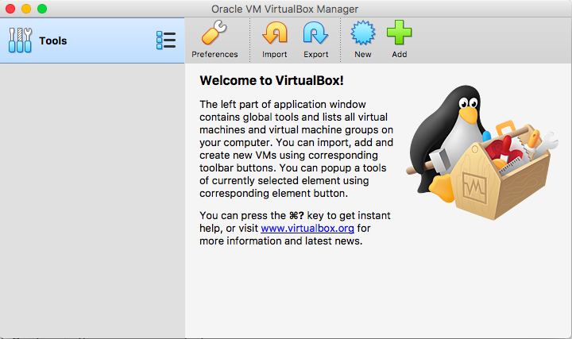
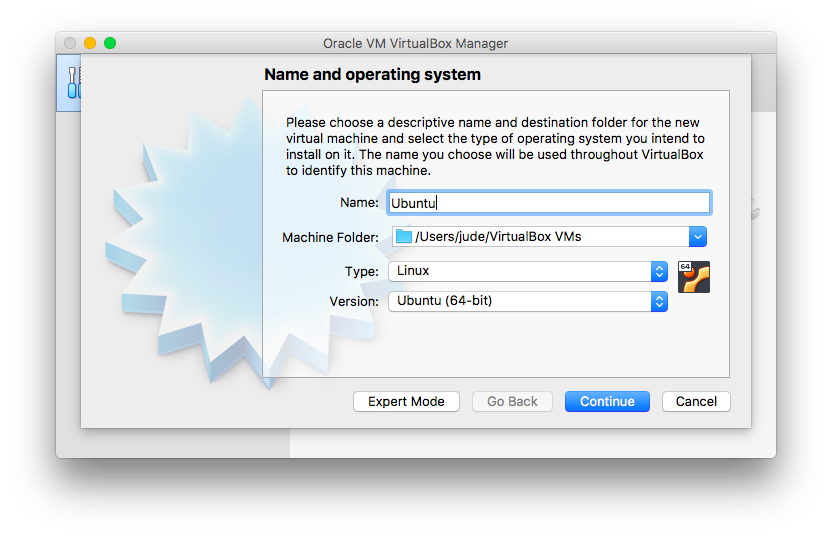
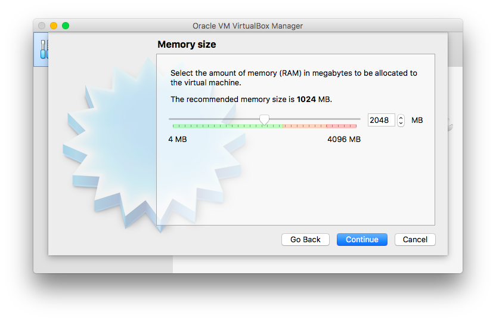
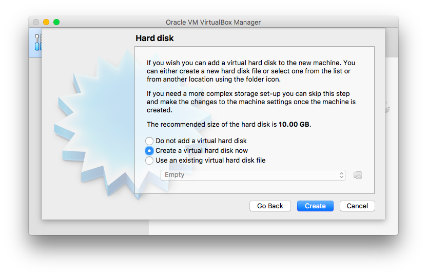
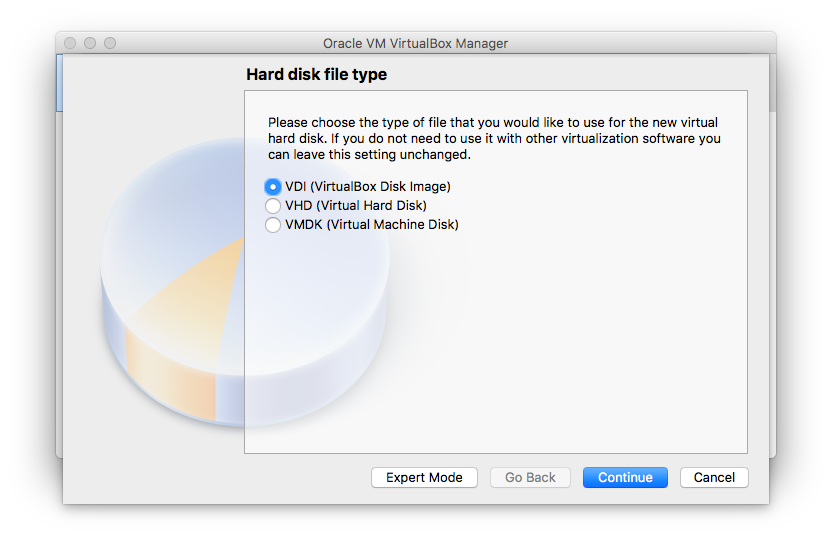
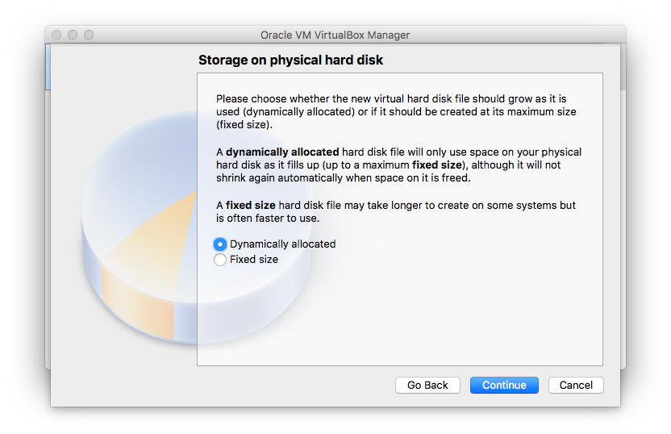
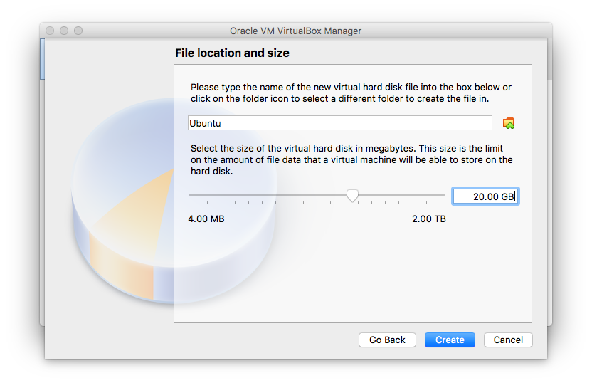
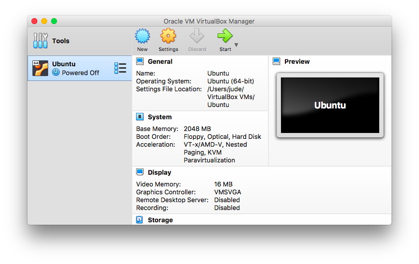
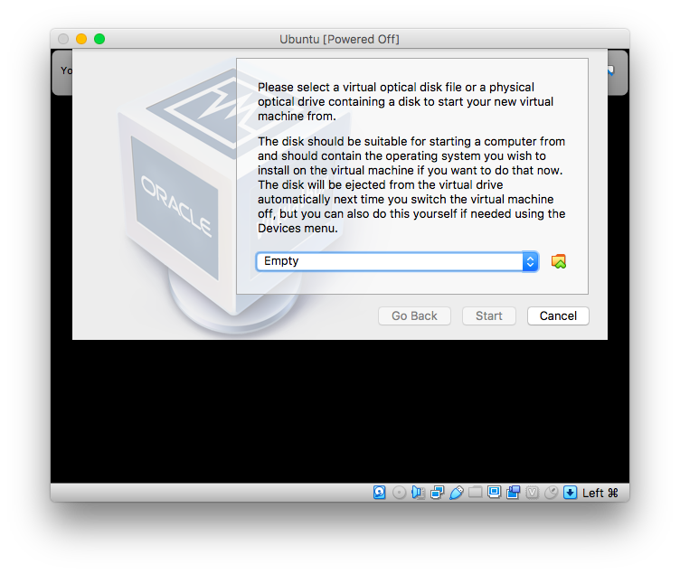

# CSCI-2050U Computer Architecture
Here you will find all of the assembly language examples covered in lectures for the Computer Architec Winter 2019 semester.

In this course we will be using **NASM Linux** to compile and run our assembly code. Our examples will not work in Windows and Mac OS due to differences in the assembly for each of the operating systems. Students are expected to run the code in Linux and should make sure the appropriate environment is setup. For students with Windows and Mac computers, it is highly recommended that Linux is installed through a virtual machine. 

#### Windows Subsystem for Linux (WSL)

While _WSL_ is a good alternative to running linux on windows for most use cases, it is not fully compatible with all the examples we will be covering at this time. 

#### NASM Brew

NASM can also be installed for Mac using the **brew** package manager. We don't recommend using this due to needing to convert all linux code to the mac compatible code. This is not always straightforward and can be time consuming to debug.


## Running Assembly Programs

Ensure that environment has been successfully setup before running any program. Each example `.asm` program will have an associated Makefile.

#### Compiling

```bash
$ make
```

#### Executing

```bash
$ ./program_name
```

It's also good practice to clear out old exectuable and object files with `make clean` before compiling the program again. 


## Evironment Setup
Please download Virtualbox installer and Ubuntu 18.04 LTS image from the following links.

**Virtualbox Installer:** https://www.virtualbox.org/wiki/Downloads

**Ubuntu 18.04 LTS: **https://www.ubuntu.com/download/desktop


### 1. Create a Virtual Machine

After Virtualbox has been downloaded and installed, you will be met with the follow screen upon opening the application.  


Click **"New"** to create a virtual machine (VM).





Give the VM a name and make sure the _**Type**_ and _**Version**_ match the following.



We will only be using the VM to write code and run our programs so the memory requirement is low. All other tasks such as web browsing, email, etc should be done you main OS. I have chosen to use **2 GB** for my VM.



Select  _**Create a virtual hard disk now**_ >> _**VDI**_ >> _**Fixed size**_.







Choose a disk size you are comfortable with. **20-50 GB** should be enough for our use case.



### 2. Installing Ubuntu

Now that we have created a VM we need to install Ubuntu on it. Double click the VM to start it.



You should be met with a screen similiar to the following prompt. Click the small folder next to the dropdown menu and select the Ubuntu image you downloaded earlier.




You will now be booting from the install image and be prompted to go through the standard Ubuntu installer. Detailed instructions on how to install Ubuntu can be found at the following website. Jump to the section label _Install Ubuntu_. Follow all the steps until ubuntu has been installed.

https://linuxconfig.org/how-to-install-ubuntu-18-04-bionic-beaver


### 3. Install Dependencies

Now that our VM and OS are ready we can install our development tools.

#### Update System

```bash
$ sudo apt update
$ sudo apt upgrade
```

#### Install Packages

Packages required for assembly language development.

```bash
$ sudo apt install build-essential nasm gdb
```
